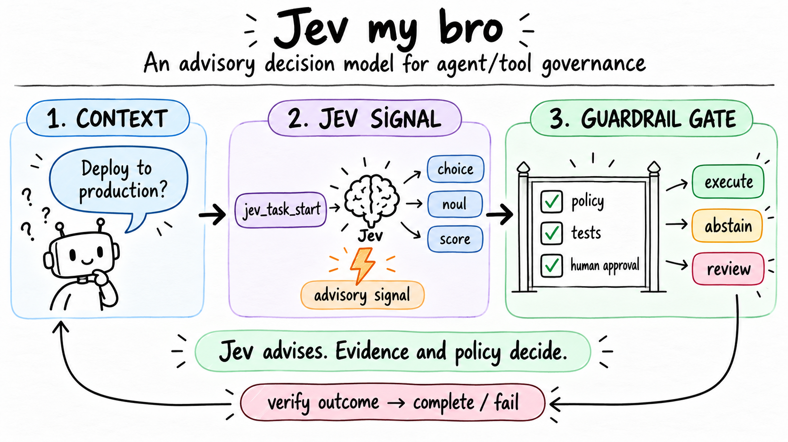

# jev-my-bro

**An advisory decision model for agent and tool governance.**

`jev-my-bro` is a self-hosted, typed decision model for agents that need to
decide whether an operation should execute, ask for approval, reject, or
escalate. It returns structured probabilities instead of generating prose as
its primary output.

<p align="center">
  
</p>

> **Jev advises. Evidence and policy decide.**

The published release remains **jev-my-bro v0.2**. The current development
line adds the Score v4 ordinal-risk redesign, the 8,508-case provenance-aware
dataset, and the shared MCP/task-feedback integration.

## The Jev contract

The runtime is intentionally bounded: open a task, request a decision, carry
out implementation, verify the result, and record completion or failure.
Jev's output is an independent signal for routing and escalation; it never
overrides repository policy, explicit approvals, tests, or human review.

| Stage | Responsibility | Typical output |
| --- | --- | --- |
| `jev_task_start` | Create a bounded task context | `task_id` |
| `jev_decide` | Ask the typed decision model | `choice`, `noul`, `score` |
| Implementation | Coding agent follows policy and approvals | Changed files / no-op |
| Verification | Run relevant tests and checks | Evidence and exit code |
| Completion | Record the actual outcome | `jev_task_complete` or `jev_task_fail` |

For the agent integration, see [`docs/MCP_INTEGRATION.md`](docs/MCP_INTEGRATION.md).

> This project is a research and engineering artifact. The checked-in dataset is
> bootstrap development data. Do not use the model as the sole production
> authorization control without reviewed operational data, an independent policy
> layer, human escalation, audit logs, and real outcome feedback.

## What it decides

For each state, the model evaluates four typed questions:

| Question | Type | Meaning |
| --- | --- | --- |
| `action` | `choice` | `execute`, `ask_user`, or `reject` |
| `needs_review` | `noul` | Whether a human review is needed |
| `prohibited` | `noul` | Whether the operation is prohibited |
| `risk` | `score` | A five-level operational risk score |

The result is a probability distribution for every question. This makes the
model useful as a routing and escalation signal, not only as a hard classifier.

Typical inputs include Git operations, deployments, production changes,
security actions, payment operations, tool calls, and requests containing Thai,
English, or mixed-language wording.

## Architecture

The active pipeline is built on the open-source Laya System-1 architecture:

```text
English/Thai state
        |
        v
Laya multilingual base
        |
        v
Typed decision head: choice / noul / score
        |
        v
RLCD + ordinal soft-target cross entropy + direct RPS
        |
        v
Independent temperature calibration
        |
        v
Native PyTorch inference -> FastAPI -> optional Go gateway
```

| Component | jev-my-bro v0.2 |
| --- | --- |
| Foundation | Laya 0.3.4 |
| Base checkpoint | `convaiinnovations/laya-multilingual` |
| Languages | English and Thai |
| Decision primitives | `choice`, `noul`, `score` |
| Training | RLCD plus ordinal soft-target CE and direct RPS for `score` |
| Calibration | One held-out temperature per primitive |
| Runtime | Native Laya/PyTorch served through FastAPI |
| Coding-agent integration | MCP v2 over Streamable HTTP or stdio |
| Optional integration | Go reverse proxy |
| Legacy baseline | `baseline/deberta` |

The model does not fit calibration temperatures on validation or test data.
Train, validation, calibration, and test remain independent.

## Dataset

The original bootstrap source contains **1,008 cases / 4,032 typed decisions**:

| Split | Cases | Typed decisions | English | Thai |
| --- | ---: | ---: | ---: | ---: |
| Train | 576 | 2,304 | 384 | 192 |
| Validation | 144 | 576 | 96 | 48 |
| Calibration | 144 | 576 | 96 | 48 |
| Test | 144 | 576 | 96 | 48 |
| **Total** | **1,008** | **4,032** | **672** | **336** |

Each case contains a state, four typed questions, and normalized probability
targets. The dataset is intentionally checked in as JSONL; no unchecked dataset
generator is part of the training path.

The original expansion target of 5,000–10,000 cases has been reached. The active
provenance-aware dataset is `data/hf_expanded/` with **8,508 cases**. Its
acceptance rules and historical expansion plan are documented in
[`docs/DATASET_EXPANSION_PLAN.md`](docs/DATASET_EXPANSION_PLAN.md), while the
published Dataset Card lives in [`data/hf_expanded/README.md`](data/hf_expanded/README.md).

Validate the active dataset before training:

```bash
python scripts/validate_dataset.py --root data/hf_expanded
python scripts/audit_hf_dataset.py --root data/hf_expanded
```

The provenance-aware expansion is in `data/hf_expanded/` and contains **8,508
cases / 34,032 typed decisions**: the original 1,008 cases plus 7,500 selected
and transformed cases from MASSIVE Thai, BANKING77, and Hermes function calling.
Each imported case records its source dataset, license, attribution, source
record, scenario family, and variant type. The same snapshot is published at
[`JonusNattapong/jev-my-bro-dataset`](https://huggingface.co/datasets/JonusNattapong/jev-my-bro-dataset).
The full audit is reproducible with:

```bash
python scripts/validate_dataset.py --root data/hf_expanded
python scripts/audit_hf_dataset.py --root data/hf_expanded
```

The audit currently reports **8,508 cases, 2,508 scenario families, and zero
structural/provenance/variant flags**. Imported labels are marked `rule_reviewed`,
not human-reviewed; the dataset must not be treated as a final production
authorization policy until reviewers inspect the source/domain/variant slices.
The published Dataset Card also documents source composition, split counts,
action imbalance, per-source licenses, transformations, and known limitations.
The ordinal-risk redesign and v4 training recipe are documented in
[`docs/SCORE_V4.md`](docs/SCORE_V4.md).

## Evaluation: what has actually run

The published v0.2 checkpoint was trained on a Google Colab NVIDIA T4. Its
historical metrics were measured before the Score v4 rubric and should not be
treated as current 8,508-case benchmark results:

| Metric | Result |
| --- | ---: |
| Test decisions | 576 |
| Accuracy | 73.78% |
| Error rate | 26.22% |
| Expected calibration error | 0.0514 |
| Score MAE | 0.5829 |
| Choice accuracy | 76.39% |
| Noul accuracy | 82.64% |
| Score exact-level accuracy | 53.47% |

The CPU error analysis is numerically slightly different because inference is
performed with CPU weights and kernels: 157/576 errors, or 27.26%. The GPU
evaluation is the source of the 26.22% figure above.

The latest Score v4 development report is `artifacts/v41/test-report.json`,
evaluated on the current 144-case `data/test.jsonl` split. It reports 74.65%
overall accuracy, 0.0743 ECE, 79.17% choice accuracy, 84.38% noul accuracy,
50.69% exact score accuracy, 0.637 QWK, 82.64% within-one score accuracy, and
0.0756 RPS. This is a local development experiment, not a replacement
published-model claim and not an 8,508-case full retraining result.

### Error analysis

The report is generated by [`scripts/error_analysis.py`](scripts/error_analysis.py)
and records primitive, language, domain, difficulty, wording slice, and expected-
to-predicted confusion pairs.

Important slices from the CPU analysis:

| Slice | Errors / total | Error rate |
| --- | ---: | ---: |
| `choice` | 38 / 144 | 26.39% |
| `noul` | 56 / 288 | 19.44% |
| `score` | 63 / 144 | 43.75% |
| English | 115 / 384 | 29.95% |
| Thai | 42 / 192 | 21.88% |
| Medium difficulty | 91 / 400 | 22.75% |
| Hard difficulty | 66 / 160 | 41.25% |

The largest action confusions were `execute -> ask_user` (19),
`execute -> reject` (6), and `ask_user -> reject` (9). These are error slices,
not causal proof: wording flags identify where to investigate ambiguity,
conflicting context, payload formatting, or dataset bias. Small domains such as
Git and code have high rates but too few cases for a reliable general claim.

Full local artifacts are written to `artifacts/error-analysis.json`, which is
ignored by Git because model outputs and reports are generated artifacts.

## Inference benchmark

The benchmark uses the real jev-my-bro checkpoint and test JSONL. It measures cold
start, first request, p50, p95, throughput, process memory, and CUDA memory for
batch sizes 1, 4, and 16.

Important implementation detail: `laya.Agent.predict` currently exposes a
single-request API. Therefore batch 1/4/16 below mean grouped sequential calls,
not a fused tensor batch. The report says this explicitly; these numbers should
not be interpreted as true batched model throughput.

### Local CPU

Measured on the development machine with PyTorch CPU:

| Batch group | p50 | p95 | Throughput | Process RSS |
| ---: | ---: | ---: | ---: | ---: |
| 1 | 1,402.62 ms | 1,565.12 ms | 0.73 req/s | 1,814 MB |
| 4 | 1,083.09 ms | 1,330.22 ms | 0.90 req/s | 1,817 MB |
| 16 | 1,055.36 ms | 1,705.46 ms | 0.83 req/s | 1,877 MB |

Cold start: model load 11.91 s; first request 0.98 s.

### Colab GPU

Measured on an NVIDIA T4 using the public checkpoint in
[`JonusNattapong/jev-my-bro`](https://huggingface.co/JonusNattapong/jev-my-bro):

| Batch group | p50 | p95 | Throughput | CUDA allocated / reserved |
| ---: | ---: | ---: | ---: | ---: |
| 1 | 29.01 ms | 37.08 ms | 32.02 req/s | 1,256 / 1,538 MB |
| 4 | 29.54 ms | 36.15 ms | 33.15 req/s | 1,256 / 1,538 MB |
| 16 | 33.72 ms | 45.68 ms | 28.73 req/s | 1,256 / 1,578 MB |

Cold start: model load 24.64 s; first request 0.95 s; process RSS about
2,047 MB. The model is therefore practical for a GPU-backed local service, but
the CPU path is latency-heavy for interactive production use.

Run the benchmark yourself:

```bash
python scripts/benchmark_inference.py \
  --model artifacts/laya-model \
  --data data/test.jsonl \
  --device cpu \
  --batch-sizes 1,4,16 \
  --warmup 2 \
  --repeats 10 \
  --report artifacts/benchmark-cpu.json
```

The Colab helper is [`scripts/colab_benchmark.py`](scripts/colab_benchmark.py).

## Comparison with OpenThai-SystemOne

OpenThai-SystemOne is the closest public comparison because it is also a typed
Thai/English System-One decision model rather than a text-generation chatbot.
The comparison below uses the OpenThai documentation and model card published
by iApp/OpenThai. It is not a claim that the two benchmark numbers are directly
comparable.

| Dimension | jev-my-bro v0.2 | OpenThai-SystemOne v0.1 |
| --- | --- | --- |
| Primary purpose | Agent/tool governance and authorization-adjacent routing | General typed decision API: routing, moderation, relevance, UI choice, scoring |
| Architecture | Laya 0.3.4 multilingual base with typed head | Qwen3.5 text tower 0.8B, continued pretraining on about 5B Thai tokens, 256-way slot head |
| Output | Native typed answers with probabilities | Typed answers with probabilities, confidence, and abstain for `choice` |
| Types | `choice`, `noul`, `score` | `choice`, `noul`, `score` |
| Choice space | Project action labels: execute / ask_user / reject | Up to 255 named options, including “none of the above” slot |
| Score space | Fixed five-level operational risk target | 2–10 ordered levels; probability-weighted fractional score |
| Training data | 8,508 cases / 34,032 decisions; 7,500 HF cases are rule-reviewed pending human audit | About 5B continued-pretraining Thai tokens; broader public evaluation sets |
| Project adaptation | Explicit governance domains and approval semantics | General-purpose Thai/English decision behavior |
| Calibration | Held-out temperature per primitive; test ECE 0.0514 | Published confidence/ECE tables and abstain signal |
| License | Project code/model usage follows repository and upstream terms; Laya is Apache-2.0 | Apache-2.0 |
| Local runtime | Native PyTorch/FastAPI; Go gateway optional | Open weights with local server recipe and hosted API |
| Public API | Local `/v1/decide` and `/v1/predict` | `POST /v3/store/openthai/systemone` |

### How to read the benchmark difference

OpenThai reports a **61.9 macro average** on a 13-subset public System-One
benchmark. Its table also reports Jev 1.13.0 at 76.0 on that same public
benchmark, but that is a different Jev release and evaluation path from this
repository's v0.2 checkpoint. `jev-my-bro` reports 73.78% on its own held-out
governance test set. These values should not be ranked against each other:

1. OpenThai's public benchmark covers NLI, QA, moderation, summarization,
   intents, and tool selection.
2. `jev-my-bro`'s current test set measures project-specific action, review,
   prohibition, and risk decisions.
3. The test sizes, labels, sampling, and evaluation code differ.
4. A fair head-to-head requires freezing a shared dataset and translating the
   same question schema without leaking examples into training.

The practical conclusion is narrower and more useful: OpenThai-SystemOne is a
stronger general-purpose public baseline with broader evidence and a larger
pretraining corpus, while `jev-my-bro` is currently more specialized for the
repository's governance contract. OpenThai's `confidence`/`abstain` interface
is a capability worth adopting or matching in a future release. Conversely,
the explicit approval, revocation, prohibited-operation, and production-risk
taxonomy is the main specialization this project is building.

### Sources

- [OpenThai-SystemOne documentation](https://iapp.co.th/docs/llm/openthai-systemone)
- [OpenThai-SystemOne model page](https://iapp.co.th/openmodels/openthai-systemone)
- [OpenThai-SystemOne weights](https://huggingface.co/iapp/OpenThai-SystemOne)
- [OpenThai-SystemOne training repository](https://github.com/iapp-technology/openthai-systemone)
- [jev-my-bro v0.2 checkpoint](https://huggingface.co/JonusNattapong/jev-my-bro)

## Training

Open [`notebooks/train_colab.ipynb`](notebooks/train_colab.ipynb) in Google
Colab, enable a GPU runtime, and point `SOURCE` at this repository. The
equivalent commands are:

```bash
pip install -r requirements.txt

python -m jevbro.train \
  --train data/hf_expanded/train.jsonl \
  --validation data/hf_expanded/validation.jsonl \
  --base-model convaiinnovations/laya-multilingual \
  --output artifacts/laya-model

python -m jevbro.calibrate \
  --model artifacts/laya-model \
  --data data/hf_expanded/calibration.jsonl

python -m jevbro.evaluate \
  --model artifacts/laya-model \
  --data data/hf_expanded/test.jsonl
```

Never tune hyperparameters against the test split. Do not commit model weights,
tokens, secrets, or Colab credentials.

## Local serving

```bash
python -m jevbro.serve \
  --model artifacts/laya-model \
  --host 127.0.0.1 \
  --port 8080
```

Health check:

```bash
curl http://127.0.0.1:8080/health
```

Decision endpoint:

```bash
curl -X POST http://127.0.0.1:8080/v1/decide \
  -H "content-type: application/json" \
  -d '{"context":"Agent wants to force push main without explicit approval"}'
```

For arbitrary Laya-compatible questions, use `POST /v1/predict`:

```json
{
  "state": {"request": "Deploy the service to production"},
  "questions": {
    "review": {
      "type": "noul",
      "instructions": "Does this require human review?"
    }
  }
}
```

For TypeSafe SDKs and Jev-class evaluation harnesses, use the compatible
`POST /v1/systemone` envelope:

```bash
curl -X POST http://127.0.0.1:8080/v1/systemone \
  -H "content-type: application/json" \
  -d '{
    "model": "jev-my-bro",
    "state": {"request": "Deploy the service to production"},
    "questions": {
      "action": {
        "type": "choice",
        "instructions": "What should the agent do?",
        "criteria": {
          "execute": "Proceed now",
          "ask_user": "Request explicit approval",
          "reject": "Do not proceed"
        }
      }
    }
  }'
```

The route accepts `jev-my-bro`, `jev-my-bro-latest`, and `jev-latest` as model
aliases and returns the TypeSafe answer envelope (`model`, `answers`, and
`usage`). It supports the published `choice`, `score`, and `noul` request and
answer shapes. Compatibility is at the HTTP contract level; the implementation
remains the local Laya checkpoint, so its configured context and question-head
token budgets still apply. Oversized rendered rubrics return HTTP 422 instead
of being silently truncated.

The optional Go gateway forwards `/health`, `/v1/decide`, `/v1/predict`, and
the namespaced integration routes under `/v1/jev-my-bro/`. Its defaults are
gateway `localhost:8090` and Python service `localhost:8080`.

### MCP for Codex, Claude Code, and OpenCode

Install the editable CLI once, then run one shared MCP process so the Laya
checkpoint is loaded once:

```powershell
.\.venv\Scripts\python.exe -m pip install -e . --no-deps
.\.venv\Scripts\jev.exe serve --model .\artifacts\laya-model --host 127.0.0.1 --port 8787
```

Clients connect to `http://127.0.0.1:8787/mcp`. For non-trivial coding tasks,
agents use `jev_task_start` -> optional `jev_decide(task_id=...)` calls ->
normal implementation/testing -> `jev_task_complete` or `jev_task_fail`.
`jev_task_status`, `jev_task_list`, and `jev_feedback_stats` provide
inspection/evaluation. The older `jev_feedback_*` and `jev_record_outcome`
APIs remain available for compatibility.

See [`docs/MCP_INTEGRATION.md`](docs/MCP_INTEGRATION.md) for Codex, Claude Code,
and OpenCode setup.

### Real-use feedback for v0.3

Jev stores task sessions, attached decisions, and final outcomes in
`artifacts/feedback/jev_feedback.sqlite3`. The same lifecycle is available from
MCP and the `jev` CLI. The commands below use the installed console entry point
directly so they work without activating the virtual environment:

```powershell
.\.venv\Scripts\jev.exe health
.\.venv\Scripts\jev.exe task start "Fix regression" --agent codex --repo jev-my-bro
.\.venv\Scripts\jev.exe task status jevtask-...
.\.venv\Scripts\jev.exe task complete jevtask-... --choice minimal_patch --tests-passed --test-command "pytest -q" --test-exit-code 0
.\.venv\Scripts\jev.exe task fail jevtask-... --reason "dependency unavailable"
.\.venv\Scripts\jev.exe task list --status completed
.\.venv\Scripts\jev.exe stats
.\.venv\Scripts\jev.exe eval
.\.venv\Scripts\jev.exe export
```

The repository also contains legacy wrappers under `scripts/`; new
documentation uses `.\.venv\Scripts\jev.exe` as the canonical Windows path.

The default export is `artifacts/feedback/v0.3-feedback.jsonl`, one row per
feedback session with nested Jev decisions. Treat it as reviewable evidence, not
gold labels to append directly to the training split. See
[`docs/FEEDBACK_LOOP.md`](docs/FEEDBACK_LOOP.md).

## Integration API

For new integrations, use the namespaced router so the product boundary is
explicit and future API versions can be added without colliding with another
service:

```bash
curl -X POST http://127.0.0.1:8080/v1/jev-my-bro/decide \
  -H "content-type: application/json" \
  -d '{"context":"Deploy the payment service to production"}'
```

The router also exposes:

| Method | Endpoint | Purpose |
| --- | --- | --- |
| `GET` | `/v1/jev-my-bro/health` | Integration health check |
| `POST` | `/v1/jev-my-bro/decide` | Governance decision using the default four questions |
| `POST` | `/v1/jev-my-bro/predict` | Custom typed questions and state |
| `POST` | `/v1/systemone` | TypeSafe-compatible typed decision wire format |

The old `/health`, `/v1/decide`, and `/v1/predict` routes remain available for
backward compatibility. The namespaced routes return `engine: jev-my-bro` so a
caller can verify that it reached the intended service.

## Verification

```bash
python scripts/validate_dataset.py --root data/hf_expanded
python scripts/audit_hf_dataset.py --root data/hf_expanded
python -m compileall -q jevbro scripts tests
pytest -q
cd server/go && go test ./...
```

Actual training, calibration, evaluation, and GPU benchmark runs require a
GPU-capable environment such as Google Colab.

## Upstream and license

jev-my-bro project code and project-authored bootstrap data are licensed under
**Apache License 2.0**; see [`LICENSE`](LICENSE). Laya is also an Apache-2.0
dependency; see [`docs/THIRD_PARTY.md`](docs/THIRD_PARTY.md).

The active dataset is mixed-source: MASSIVE Thai rows record CC BY 4.0,
BANKING77 rows record MIT, while Hermes function-calling rows and the 1,008
project-authored bootstrap rows are Apache-2.0. The repository Apache license
does not override upstream dataset terms. See
[`data/hf_expanded/README.md`](data/hf_expanded/README.md),
[`docs/THIRD_PARTY.md`](docs/THIRD_PARTY.md), and
[`data/hf_expanded/SOURCE_MANIFEST.json`](data/hf_expanded/SOURCE_MANIFEST.json)
before redistributing derived artifacts.

## Status

The published v0.2 release establishes the Laya training/serving path and real
Colab checkpoint. Current development adds Score v4 ordinal targets/losses,
the 8,508-case provenance-aware dataset, richer ordinal evaluation, and MCP
task feedback. The next model-quality milestone is human review of the
8,508-case dataset followed by a fresh full train/calibration/test run.

Documentation index: [`docs/README.md`](docs/README.md).
