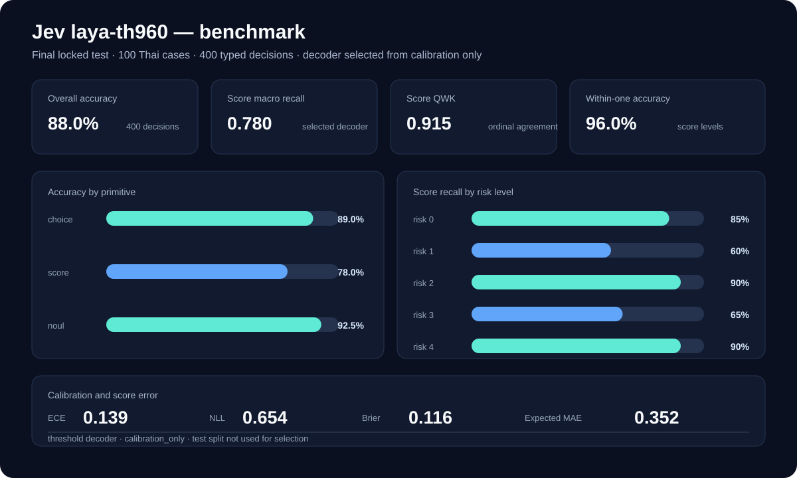

# jev-my-bro

Jev is a self-hosted typed decision model for agent and tool governance. It
turns a request into four signals:

- `action`: `execute`, `ask_user`, or `reject`
- `needs_review`: whether a human must review before execution
- `prohibited`: whether the operation must be blocked
- `risk`: an ordinal operational-impact score from 0 to 4

Jev is an advisory component. It must not replace repository policy, explicit
approval, tests, audit logs, or a human safety boundary.

## Latest Thai model

The latest manually curated Thai experiment is `laya-th960`:

- Model: [JonusNattapong/jev-my-bro-th960](https://huggingface.co/JonusNattapong/jev-my-bro-th960)
- Dataset: [JonusNattapong/jev-my-bro-dataset-th960](https://huggingface.co/datasets/JonusNattapong/jev-my-bro-dataset-th960)
- Model Card: [`docs/model-cards/jev-my-bro-th960.md`](docs/model-cards/jev-my-bro-th960.md)
- Training data: 960 Thai cases
- Validation, calibration, and test: 100 cases each
- Test: 100 cases, 400 typed decisions, 20 cases per risk level
- Selected checkpoint: epoch 5, selected from validation
- Test decoder: threshold, selected from calibration only



### Final locked test result

The following result was produced after calibration and a locked test
evaluation. The test split was not used to fit temperatures or select the
decoder.

| Metric | Result |
| --- | ---: |
| Overall accuracy | **88.00%** |
| ECE | 0.1391 |
| NLL | 0.6540 |
| Brier score | 0.1159 |
| Score expected MAE | 0.3517 |
| Score hard MAE | 0.2600 |
| Score within-one accuracy | **96.00%** |
| Score QWK | **0.9150** |
| Score RPS | 0.0433 |
| Score macro recall | **0.7800** |

Primitive accuracy:

| Primitive | Accuracy | Brier |
| --- | ---: | ---: |
| `choice` | 89.00% | 0.1167 |
| `noul` | 92.50% | 0.0572 |
| `score` | 78.00% | 0.2327 |

Score recall by risk level:

| Risk | Support | Recall |
| ---: | ---: | ---: |
| 0 | 20 | 85% |
| 1 | 20 | 60% |
| 2 | 20 | 90% |
| 3 | 20 | 65% |
| 4 | 20 | 90% |

The remaining weakness is the boundary between risk 1 and risk 3. ECE is also
not perfect, so confidence should be treated as a routing signal rather than a
guarantee.

## Use the published model

The model repository is private unless it is made public by its owner. In
Colab, authenticate without placing a token in a notebook cell:

```python
%cd /content/jev-my-bro
!pip install -q -r requirements.txt

from huggingface_hub import notebook_login
notebook_login()
```

Load the model and make a Thai decision:

```python
import json
import torch
from laya import Agent
from jevbro.questions import default_questions

MODEL_ID = "JonusNattapong/jev-my-bro-th960"
DEVICE = "cuda" if torch.cuda.is_available() else "cpu"
agent = Agent(MODEL_ID, device=DEVICE)

def decide(request: str, domain: str = "general") -> dict:
    result = agent.predict(
        {"request": request, "domain": domain},
        default_questions("th"),
    )
    answers = result["answers"]
    return {
        "request": request,
        "action": answers["action"]["choice"],
        "needs_review": answers["needs_review"]["noul"],
        "prohibited": answers["prohibited"]["noul"],
        "risk_score": answers["risk"]["score"],
        "action_probabilities": answers["action"]["probabilities"],
        "risk_probabilities": answers["risk"]["probabilities"],
    }

print(json.dumps(
    decide("เปลี่ยนค่า firewall ของ production ให้เปิดจากอินเทอร์เน็ต", "network"),
    ensure_ascii=False,
    indent=2,
))
```

For a checkpoint already downloaded in Colab, use:

```python
agent = Agent("artifacts/laya-th960", device="cuda")
```

Always put the policy gate outside the model:

```python
result = decide("ลบข้อมูลใน production ที่ไม่ใช้แล้ว", "database")

if result["prohibited"] >= 0.5 or result["action"] == "reject":
    decision = "reject"
elif result["needs_review"] >= 0.5 or result["action"] == "ask_user":
    decision = "human_review"
else:
    decision = "execute"
```

The prohibited signal has priority over the raw action. This prevents an
ambiguous raw `ask_user` result from weakening a clear prohibited signal.

## Run the local HTTP service

Install the project and start the native Laya/PyTorch service:

```powershell
python -m venv .venv
.\.venv\Scripts\python.exe -m pip install -r requirements.txt
.\.venv\Scripts\python.exe -m pip install -e . --no-deps

.\.venv\Scripts\python.exe -m jevbro.serve `
  --model JonusNattapong/jev-my-bro-th960 `
  --host 127.0.0.1 `
  --port 8080
```

Check health:

```powershell
curl http://127.0.0.1:8080/health
```

Ask for a typed governance decision:

```powershell
curl -X POST http://127.0.0.1:8080/v1/decide `
  -H "content-type: application/json" `
  -d '{"context":"Deploy the payment service to production","language":"en"}'
```

The service also exposes `/v1/predict`, `/v1/jev-my-bro/decide`,
`/v1/jev-my-bro/predict`, and `/v1/systemone`. See
[`docs/MCP_INTEGRATION.md`](docs/MCP_INTEGRATION.md) for connecting Codex,
Claude Code, or OpenCode through MCP.

## Reproduce the Thai 960 training run

The checked-in source rows are manually authored. The builder creates the
JSONL splits and checks unique IDs, unique requests, action-label consistency,
and balanced holdouts.

```bash
python scripts/build_th_curated_960.py
python scripts/validate_dataset.py --root data/th_curated_960
```

The split layout is:

| Split | Cases | Decisions | Purpose |
| --- | ---: | ---: | --- |
| Train | 960 | 3,840 | Fit model weights |
| Validation | 100 | 400 | Select checkpoint |
| Calibration | 100 | 400 | Fit temperature and score decoder |
| Test | 100 | 400 | One locked final evaluation |

On a Colab T4:

```bash
!python -m jevbro.train --config configs/colab-th960.yaml

!python -m jevbro.calibrate \
  --model artifacts/laya-th960 \
  --data data/th_curated_960/calibration.jsonl \
  --report artifacts/laya-th960/calibration-report.json

!python -m jevbro.evaluate \
  --model artifacts/laya-th960 \
  --data data/th_curated_960/test.jsonl \
  --device cuda \
  --lock-decoder \
  --report artifacts/laya-th960/test-report.json
```

`calibrate` refuses a path named `test.jsonl`. The `--lock-decoder` flag
requires calibration provenance in `rl_agent_config.json`, including the
calibration dataset hash, before evaluating test.

## Architecture

```text
Thai/English request
        |
        v
Laya multilingual encoder
        |
        v
Typed heads: choice / noul / score
        |
        v
RLCD + soft-target CE + ordinal/RPS score objectives
        |
        v
Calibration split: temperatures + score decoder
        |
        v
Native inference -> FastAPI -> optional MCP or Go gateway
```

The project uses Laya 0.3.4 with the `convaiinnovations/laya-multilingual`
base checkpoint. Calibration is independent from validation and test. The
test set is not used for training, temperature fitting, decoder selection, or
threshold tuning.

## Repository layout

```text
jevbro/                         shared inference, calibration, evaluation
configs/colab-th960.yaml        reproducible T4 training config
data/th_curated_960/            Thai 960-case JSONL splits and README
scripts/build_th_curated_960.py dataset builder and integrity checks
scripts/probe_real_requests.py  qualitative real-request probe
docs/assets/laya-th960-benchmark.svg  final locked benchmark visualization
tests/                          unit, data, and workflow tests
```

## Verification

```bash
python scripts/validate_dataset.py --root data/th_curated_960
python -m compileall -q jevbro scripts
pytest -q
```

The latest repository verification passed with **62 tests**. GPU training and
the final laya-th960 metrics were run in Google Colab; they are not reproduced
by the local test suite.

## Limitations and safety

- The Thai 960-case set is manually curated development data, not a complete
  production authorization policy.
- The test report is a benchmark on this held-out set, not proof of safety on
  unseen organizations or domains.
- Risk 1 and risk 3 remain the weakest per-level recall slices.
- Keep an independent policy layer, explicit approvals, human escalation,
  audit logs, and outcome feedback around the model.
- Never put Hugging Face tokens, private keys, or production credentials in
  this repository or a notebook.

## License

Project code and project-authored data are licensed under the Apache License
2.0; see [`LICENSE`](LICENSE). Laya is also Apache-2.0. Review
[`docs/THIRD_PARTY.md`](docs/THIRD_PARTY.md) before redistributing datasets or
derived artifacts.
